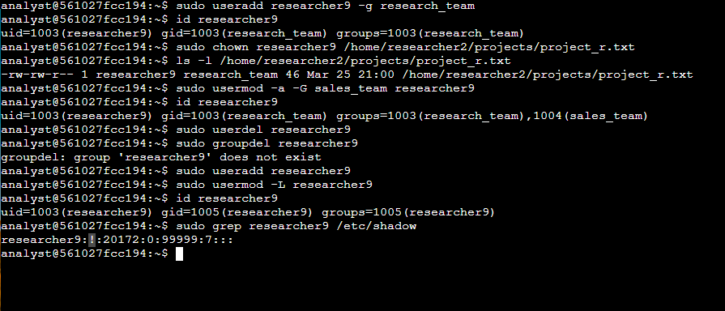

# 🐧 Linux User Management Lab
This repository contains a lab exercise from the Google Cybersecurity Professional Certificate program. The lab focuses on user management tasks in a Linux environment, including adding, modifying, and deleting users, as well as managing group permissions.

---

## 📸 **Screenshot**

---

## 🔥 **Scenario**
A new employee, `researcher9`, joins the organization. You are tasked with managing their access and permissions throughout their employment. 

---

## ✅ **Tasks and Explanations**

### 🛠️ **Task 1: Add a New User**
```bash
sudo useradd researcher9 -g research_team
```
**Explanation:**  
- `sudo useradd researcher9 -g research_team`: Creates a new user and adds them to the research_team group 

✅ *After creating the user, I used this command:*
```
id researcher9
```
This command shows us the user ID and his groups, confirming that the user was successfully added.

---

### 📁 **Task 2: Assign File Ownership**
```
sudo chown researcher9 /home/researcher2/projects/project_r.txt
```
**Explanation:**  
- `chown`: Changes the ownership of the `project_r.txt` file.  
- The ownership is transferred to `researcher9`.
- I used the full path `/home/researcher2/projects/project_r.txt` (instead of navigating to the directory with "cd" commands) to save time.

✅ *next command:*  
```
ls -l project_r.txt
```
This command displays the file permissions and ownership, confirming that `researcher9` is now the owner. (again with the full path)

---

### 👥 **Task 3: Add User to a Secondary Group**
```
sudo usermod -a -G sales_team researcher9
```
**Explanation:**  
- `usermod`: Modifies a user’s properties.  
- `-a -G`: Appends the user to the `sales_team` group without removing them from their primary group. (later on i learned that there is no need to use two seperate "-" and instead a command can be done with just "-aG")

✅ *I verified the group change with:*  
```
id researcher9
```
This shows that `researcher9` is now a member of both `research_team` and `sales_team`.

---

### ❌ **Task 4: Lock or Delete the User**

**Option 1: Lock the User**
```
sudo userdel researcher9
    followed by
sudo groupdel researcher9
```
**Explanation:**  
- `sudo userdel`: deletes a user and the "sudo groupdel" deletes the group that gets automatically created with the user (in my case the `sudo useradd researcher9 -g research_team` explicitly specified the primary group as research_team instead of letting the system create a default group).
- As you can tell in the end i added the user back just for the purpose of demonstrating this command `sudo usermod -L` : this command locks the user account by adding a `!` before the encrypted password in `/etc/shadow`, preventing logins. This is a safer approach before full deletion as the organization can make all the changes needed to the files, or needed backups before deleting the user.

✅ *To verify the lock:*  
```
sudo grep researcher9 /etc/shadow
```
I used the `sudo grep researcher9 /etc/shadow` command to demonstrate that the user has been locked. (we can tell that by the outputs exclamation mark ":!:")

---

### 💀 **Option 2: Delete the User**
```bash
sudo userdel -r researcher9
```
**Explanation:**  
- `userdel`: Removes the user.  
- `-r`: Deletes the home directory and all associated files.  
- Use this only if you are sure all necessary backups are made.

---

## 💻 **Commands Used**
- `useradd -m -s /bin/bash researcher9` → Add new user with home directory and shell.  
- `passwd researcher9` → Set the user password.  
- `chown researcher9 project_r.txt` → Change file ownership.  
- `usermod -aG sales_team researcher9` → Add user to secondary group.  
- `passwd -l researcher9` → Lock the user account.  
- `userdel -r researcher9` → Remove the user (with caution).  
- `id researcher9` → Verify user and group information.  
- `ls -l` → Display file permissions.  
- `grep researcher9 /etc/shadow` → Confirm if the user is locked.  

---

## 🚀 **Skills Learned**
- Adding and managing users.  
- Modifying group memberships.  
- Changing file ownership.  
- Locking and deleting users.  
- Verifying and confirming changes.  

---

## 📂 **Folder Contents**
- `/screenshots/user_management_lab.png`: Terminal output showing the lab results.

